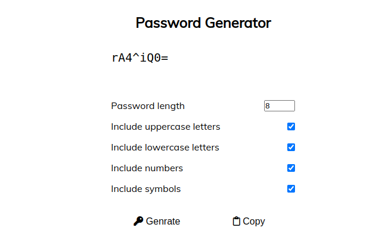

# Password_Generator_System

Create strong and secure passwords to keep your account safe online. Strong passwords use a combination of letters, numbers, cases, and symbols to form an unpredictable string of characters that doesn't resemble words or names.A strong password should be unique to each account to reduce vulnerability in the event of a hack. The longer a password, the more secure it is.

1. Download this repository and extract the file
2. Run 'index.html' file in browser

## Screenshot

